# Team Solstice Math Game

## Description

This application will present 3 tasks for the students:  addition, subtraction, and place value.  It will also provide the teacher with the game results and flag areas that individual students are having trouble with. The game will feature cute pictures of the dog Cookie as incentive for the students playing the game.

## Diagrams

This section mainly contains wireframes of the various user screens.

## Login Screen

The same login screen will be used for all users, and will feature a login prompt and a photo of an expectant Cookie.

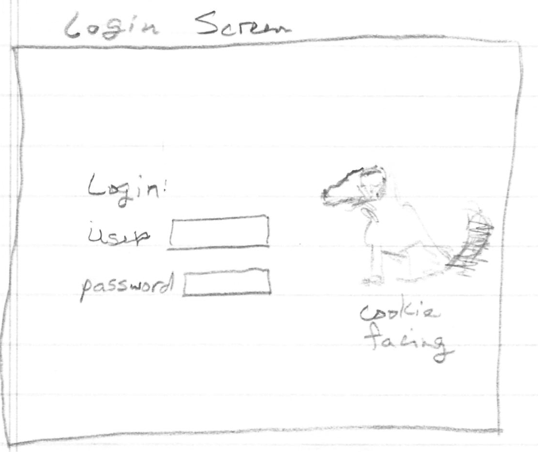

## Student Screens

### Welcome

The students will be presented with a welcome screen that summarizes their progress and provides a button to press when they are ready to continue.

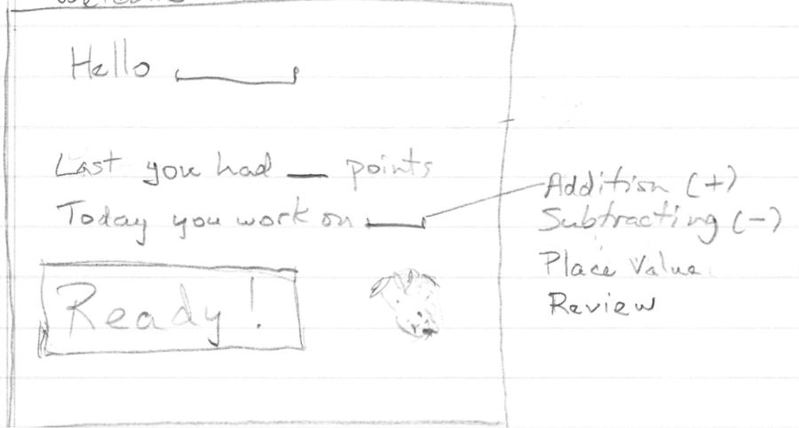

### Addition

The students will be presented with similar screens for addition and subtraction exercises.

User enters answer and presses return, enter, or the submit button.  If the answer is correct, Cookie wags her tail.  If the answer is wrong, Cookie pouts and gives correct answer.

See Right Answer and Wrong Answer screens.

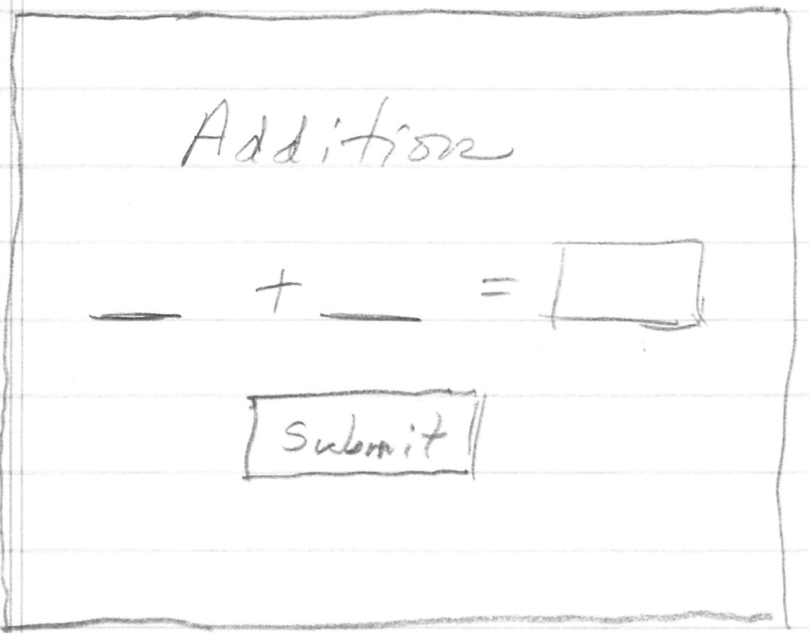

### Right Answer

The answer dialog boxes are modal boxes that are shown after the user submits an answer.
After submission, results are stored, including the problem and answer.

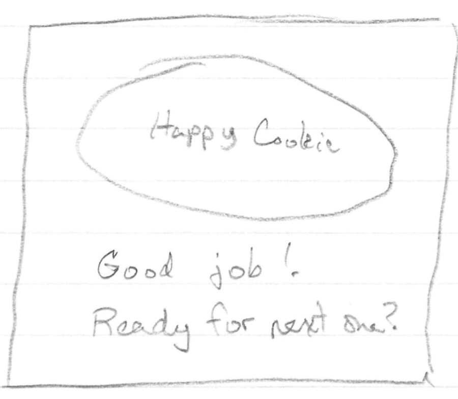

### Wrong Answer

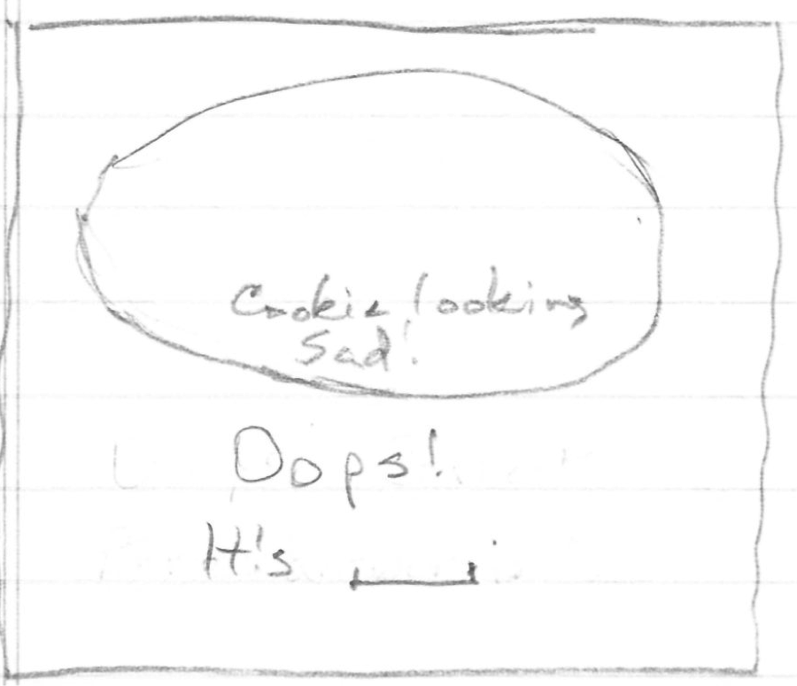

The correct answer is shown under Oops.

### Place Value - Easiest

There are three levels of Place Value screens, which are split into two difficulty levels.  These levels are 2-digit and
3-digit place values.  The first two levels of screens will cover the 2-digit place value, and the 2nd and 3rd levels
will cover the 3-digit place values.

The student will be presented with the easiest screens after mastering 1 digit addition and subtraction, and will use
2-digit numbers.
The other screens will be presented after the student masters the easiest screens.

The second section, in level 2, comes after adding/subtracting 2-digit and 1-digit numbers. This section is 3-digit place values.

Each of these sections will have multiple rounds of progressively more difficult concepts.

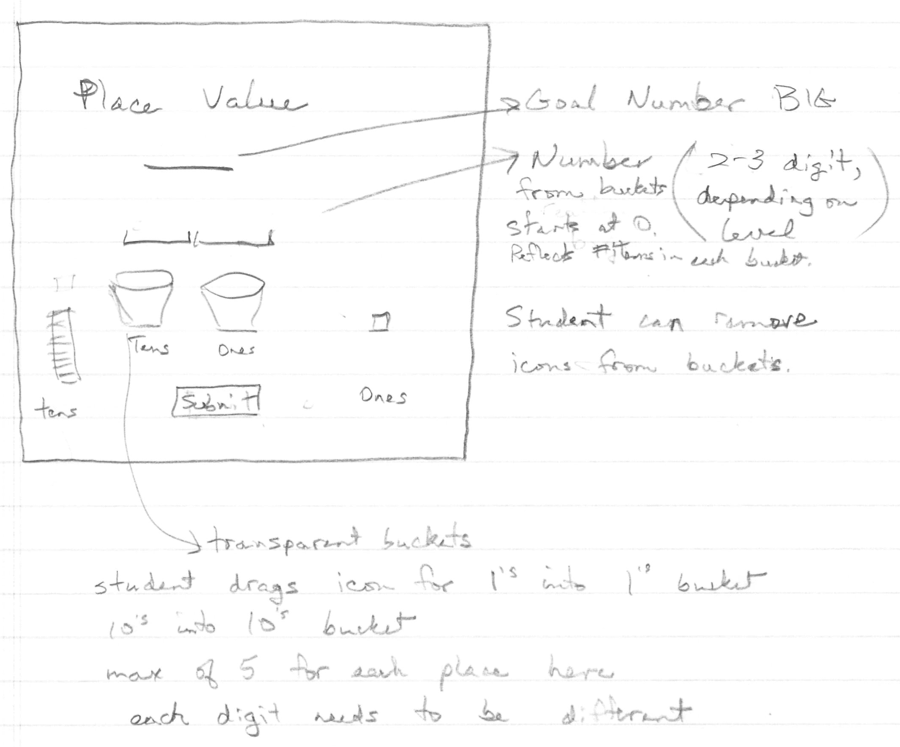

### Place Value - Intermediate

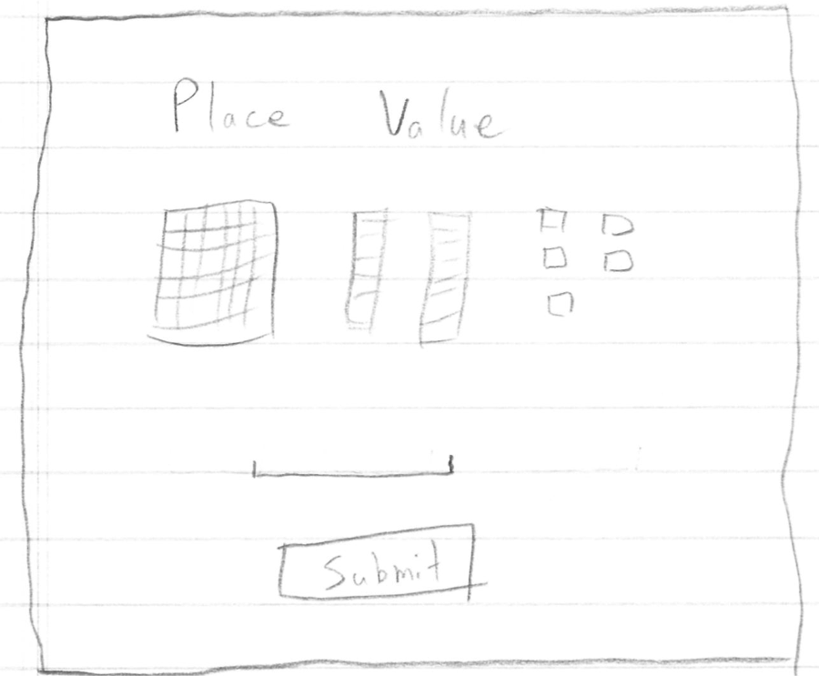

Icons on the screen are for 100’s, 10’s, and 1’s.  The student is presented with icons representing a 2 or 3 digit number (depending on student level).  The student is to type the number represented by the icons (125 in this example) and click submit.

### Place Value - Hardest

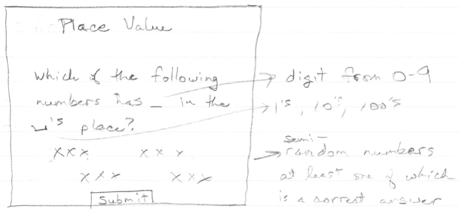

User select number, and if correct, digit is highlighted.  The number of digits is two for beginning levels of place value, and 3 for the second level.

## Teacher Pages

Teachers will use the same login as students.  Other screens are described below.

### Class Overview

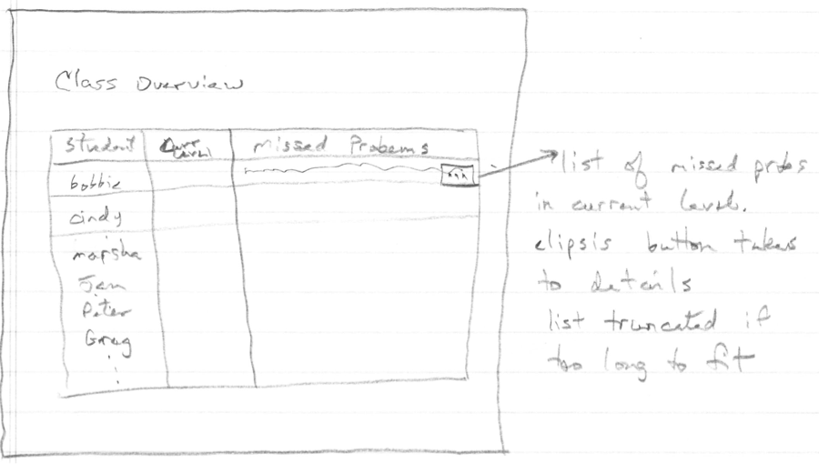

### Teacher Administration

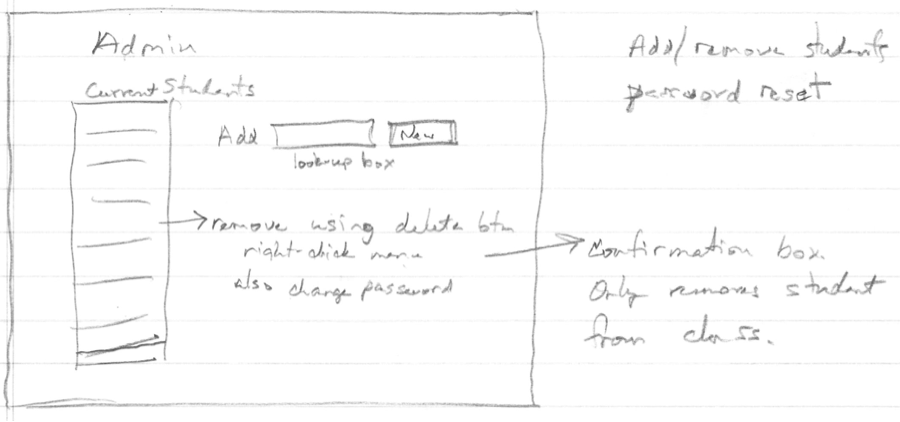

## Administrator Pages

Administers need to add and remove teachers, students, and classes.  They also need to assign teachers and students to classes.

### Administer Users

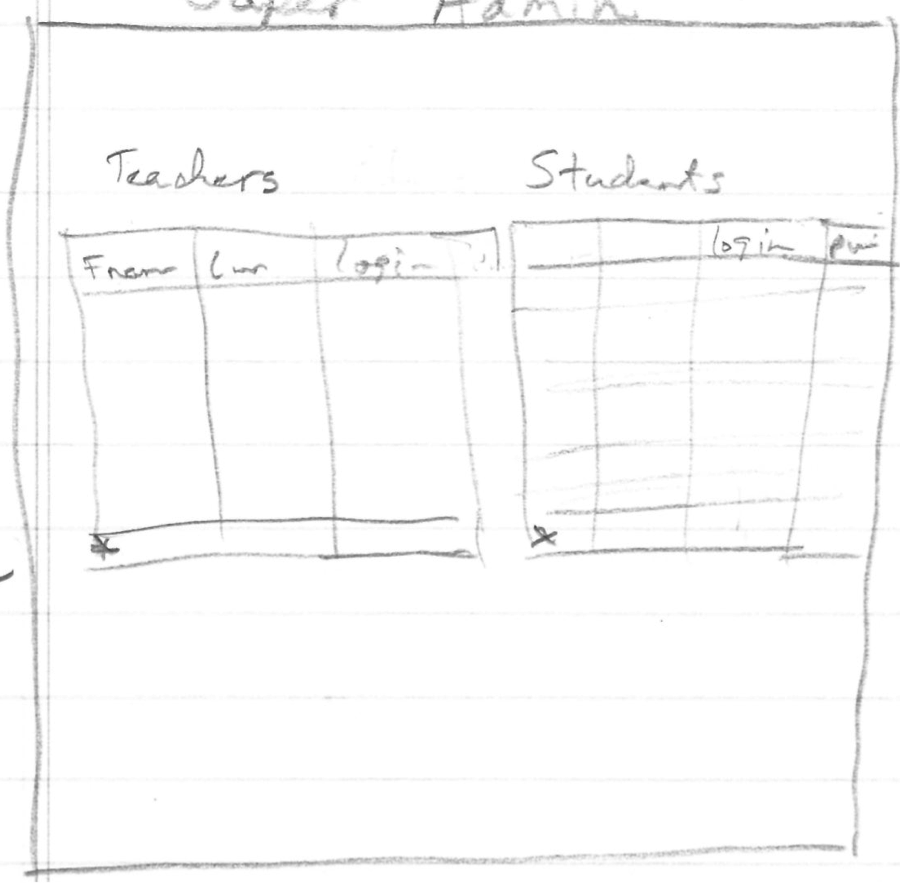

Teachers and students are pulled from school system if available, or entered manually here.  An add icon is positioned at the bottom of each table.  The user right-clicks to delete a user or reset the user password.
All passwords are encrypted.  Delete does not remove a user or associated data from the database, but merely removes the user and data from active use.  Students and teacher are in the same table in the backend database, but shown separately in the application.

### Administer Classes

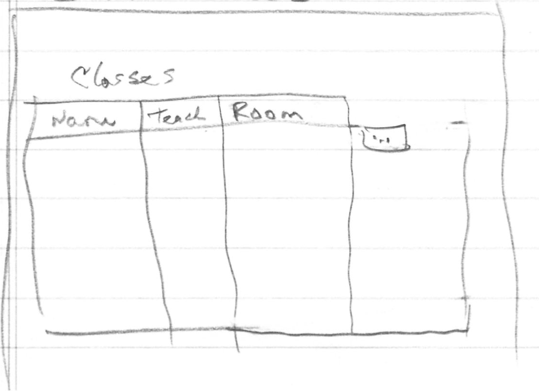

A table will display the currently defined classes.  An ellipsis icon will take the user to the class details screen.

### Class Details

Class details include the classroom, teacher, and students.  A lookup field will be used to select students to add, like in the teacher administration screen.

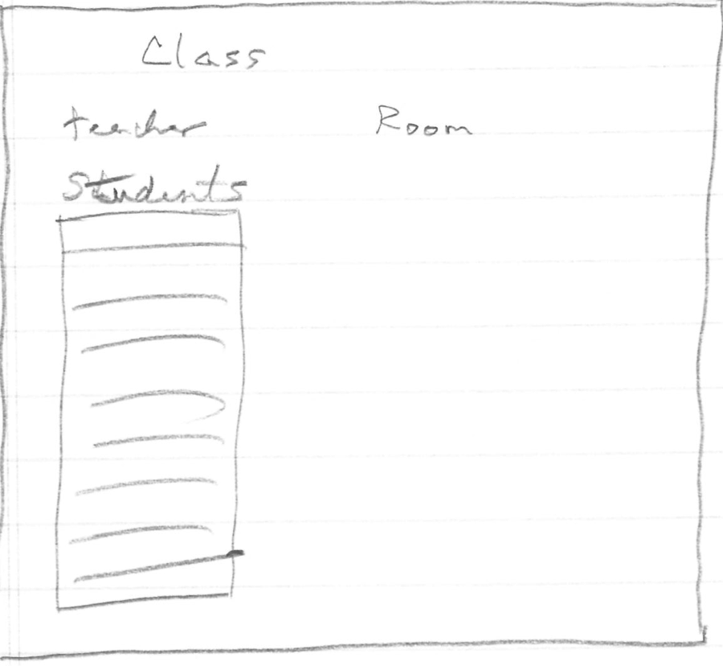

## User Profiles

### Students

- Ages 6 to 7
- Expected to be able to perform addition and subtraction with up to 2 digits
- Expected to be able to identify ones, tens and hundreds places
- Will receive notification and feedback based on progress
- Are expected to know how to use a mouse, keyboard and computer
- Have a basic understanding of web applications
- Know how to use buttons, text entry fields, checkboxes

### Teachers

- Have a class of children needing to learn and reinforce math skills
- Knows how to navigate and use a computer and web based application
- Needs information on each student’s progress.
- Reviews problem areas with students

## Usage

### Students

Student logs in, sees Cookie (dog), and is presented with a game to test math skills.  The application keeps track of student progress, and works him/her through the set of quizzes.  Student will receive positive and negative feedback based on performance. The application will store the student’s progress through the game in case they exit the application before completing addition, subtraction or place values. The application will also keep a list of any questions that the student gets wrong for the teacher to review later.

### Teachers

Teacher logs in and sees a grid of the students and the progress each has made in each of the three math areas.  The teacher then uses this information to determine if any of the students need additional help, including changing the quizzes the student is given in the application.
The teacher also administers the class roster and the student passwords within the class (AKA, resets them and provides the new password to the student).

### Administrators

Administrators add and remove teachers and students, assign teachers and students to classes, and reset passwords.
